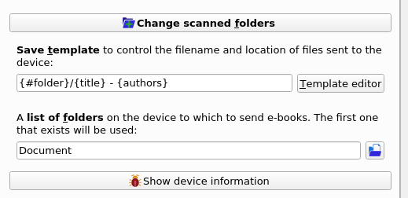
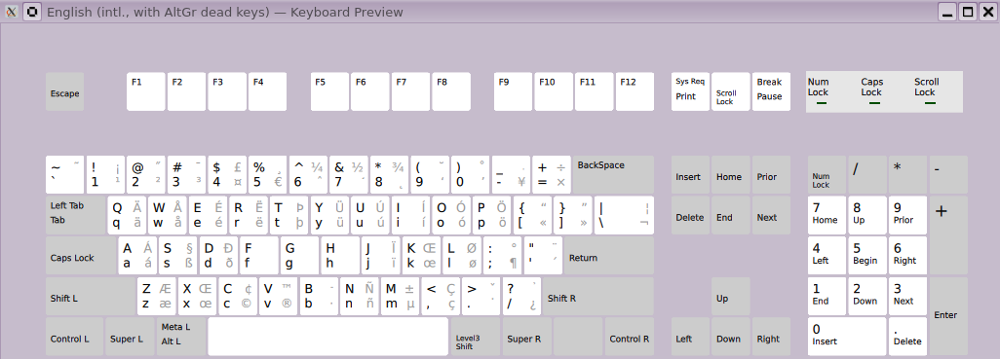

+++
title = "202503 Snippets and Links"
date = 2025-03-25
description = "New post format, calibre + supernote folder structure, altgr-intl, new box runbook"
aliases = ["articles/202501-snippets-links"]

[taxonomies]
tags = ["snippets"]
+++

Trying out a new format, hoping this reduces the friction involved in adding more content when it's not long enough to justify a full post.

## Calibre + Supernote Folder Organisation

Calibre supports the Supernote Android eink devices, but the default setup will send your entire library into the top level of the Documents folder.

To fix this visit the Preferences -> Plugins screen and double click MTP.


Next you have multiple choices. You can change «list of folders» to select a specific folder to put all books into, or you can leave that at the default and change the «Save template» setting to include a column which has the folder to send each individual book to.



In this example I'm using the «Save template» field. It's set to the `#folder` custom column, which I defined as a «Column built from other columns» with the following template: `{#kobo_collections:contains(paper, papers, fics)}`.  
This example means that if the `#kobo_collections` tag column contains `paper` the book is sent to the papers folder, otherwise it's sent to the fics folder.

## Set up the compose key and altgr-intl keyboard variant

If you use a US keyboard, try out the altgr-intl variant to get access to more useful characters. You can tell I just set this up by my frivolous use of guillemets above…



You can set up a compose key for even more symbols.

| Compose Sequence | Symbol | Unicode | Description |
|-----------------|--------|----------|-------------|
| `<v> <slash>` or `<slash> <v>` | √ | U221A | SQUARE ROOT |
| `<8> <8>` | ∞ | U221E | INFINITY |
| `<colon> <period>` | ∴ | U2234 | THEREFORE |
| `<period> <colon>` | ∵ | U2235 | BECAUSE |
| `<~> <~>` or `<dead_tilde> <dead_tilde>` | ≈ | U2248 | ALMOST EQUAL TO |
| `<equal> <underscore>` | ≡ | U2261 | IDENTICAL TO |

`setxkbmap us -variant altgr-intl -option compose:rwin` sets the X11 keyboard layout to altgr-intl and uses the right windows key as a compose key. `compose:menu` is another popular option.

```nix
{
    services.xserver.xkb.layout = "us";
    services.xserver.xkb.variant = "altgr-intl"; # «cool and new»
    services.xserver.xkb.options = "compose:rwin"; # grp:caps_toggle,grp_led:scroll
    # Required for some compose key mappings to work
    # <Multi_key> <Z> <Z>			: "ℤ"	U2124 # DOUBLE-STRUCK CAPITAL Z
    # just showed underlined CC without setting this
    environment.variables.GTK_IM_MODULE = "xim";
    environment.sessionVariables.GTK_IM_MODULE = "xim";
}
```

## New box runbook

I try to configure most aspects of my systems declaratively in LunNova/nixos-configs.  
Some things are easier to do impurely.

- [ ] If using impermanence/persistence
  - [ ] Verify persisted dirs are bind mounted
  - [ ] Write something into ~ and reboot to confirm it's still there
  - [ ] Write user password hash to persist vol
- [ ] If using FDE
  - [ ] Ensure a recovery key that doesn't rely on TPM is safely recorded and tested
- [ ] Browser
  - [ ] uBlock Origin
  - [ ] Password manager
- [ ] Join tailnet
- [ ] Configure syncthing
- [ ] Ensure fstrim/discard is working so SSD won't die
- [ ] Ensure some sort of alert if the system is severely outdated is present
