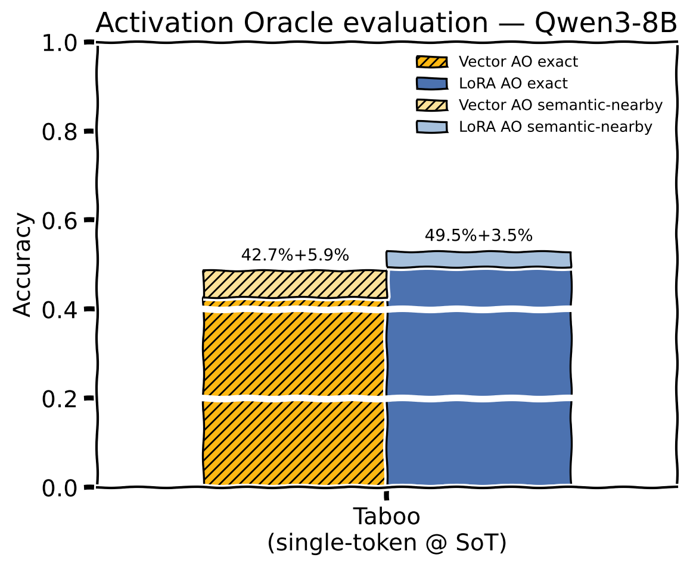
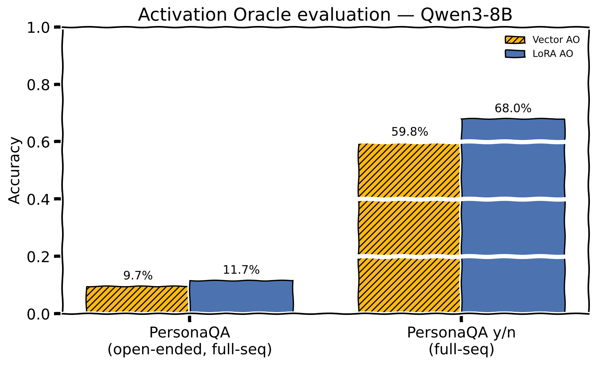
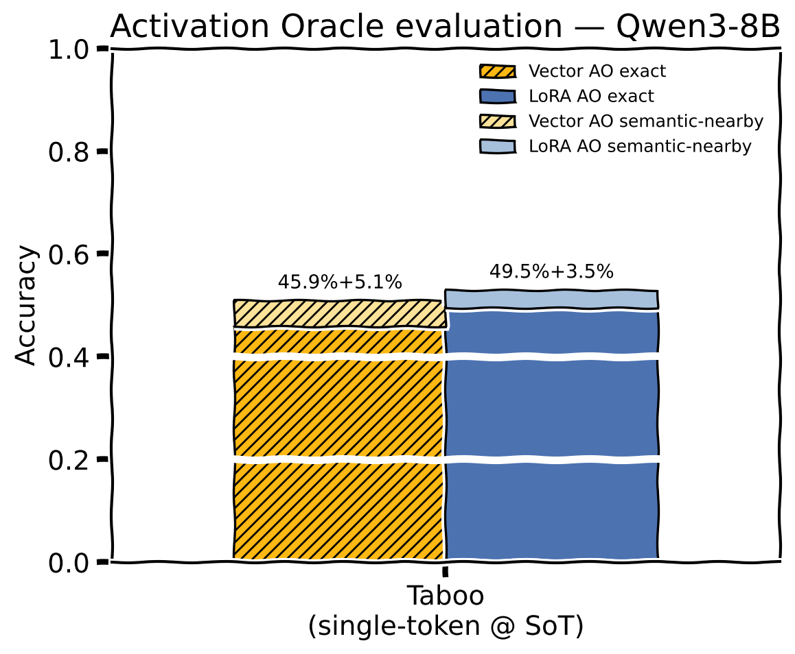
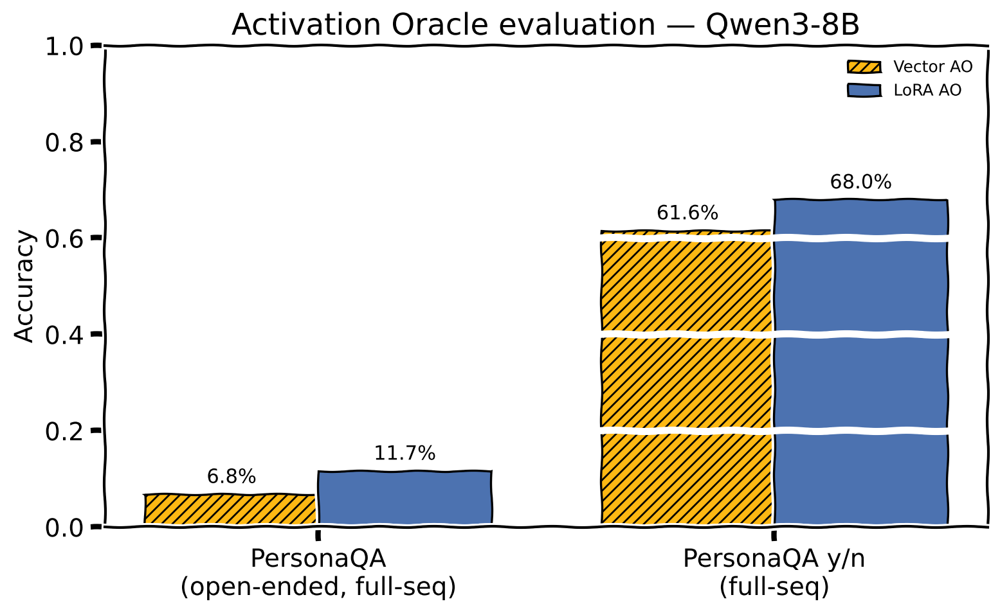
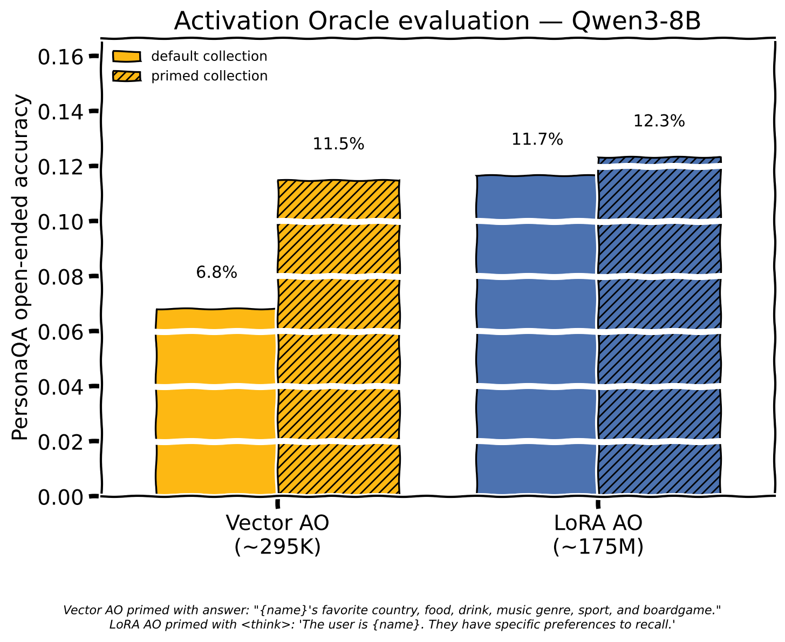
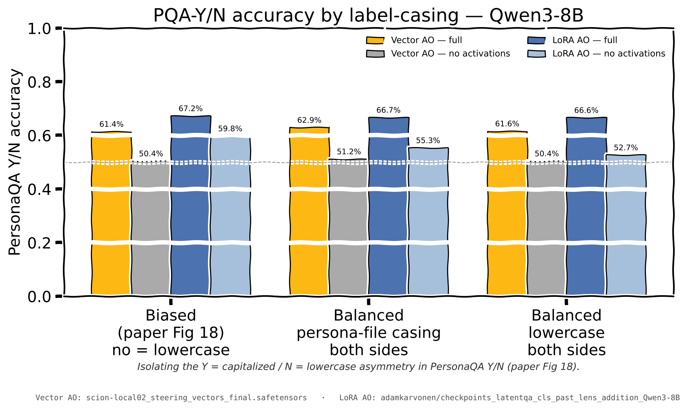
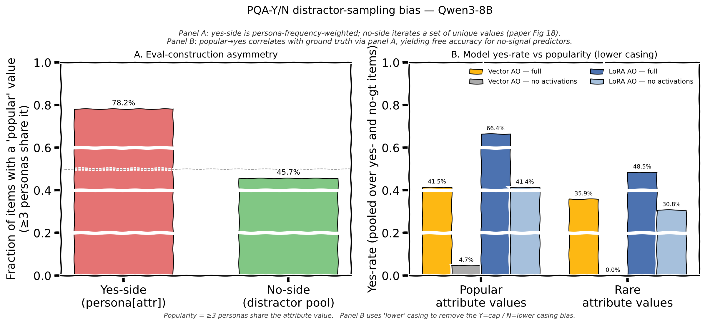
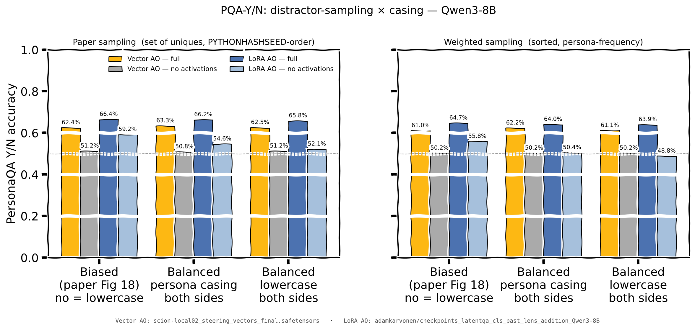

+++
title = "Trained steering vectors may work as activation oracles"
description = "Preliminary finding from testing on Qwen 3 8B"
date = 2026-04-22
updated = 2026-04-24
tags = ["machine learning"]
+++

Inspired by Eriskii's recent finding that [trained steering vectors](https://www.lesswrong.com/posts/kyWCXaw4tPtcZkrSK/instruct-vectors-base-models-can-be-instruct-with-activation) can teach a base model to act as an assistant, I replaced the [Activation Oracle paper](https://www.lesswrong.com/posts/rwoEz3bA9ekxkabc7/activation-oracles-training-and-evaluating-llms-as-general)[^ao]'s trained LoRA with a far smaller set of per layer trained steering vectors and found surprisingly good eval results, far better than anticipated from the tiny param count.

<aside>

Not familiar with Activation Oracles? Take a look at Anthropic's [AO page](https://alignment.anthropic.com/2025/activation-oracles/) for an introduction and some diagrams.

</aside>

- Trained per-layer steering vectors on Qwen3-8B as an activation oracle
- Standard activation injection mechanism with " ?" placeholders
- Collected activation ranges (full sequence vs assistant SoT) matching AO paper
- 36 layers × (post-attn + post-MLP) × 4096 dim = ≈295K trainable params vs. ≈175M AO LoRA
  - **≈1/600th** of the LoRA AO's params, **≈0.004%** of Qwen3-8B's param count
- Data mix like AO paper (≈1M examples, ≈60% context prediction / 33% binary classifier / 6% SPQA)
  - Filtered out ≈5K long SPQA examples with >96 tokens in answer or input to reduce peak VRAM requirements
- Close to standard Activation Oracle Taboo[^taboo] accuracy, significant deficit on PersonaQA[^personaqa]
- Vector approach seems to be more fragile to the specific text activations were collected from

## Preliminary Results

<figure style="flex: 1 1 420px; min-width: 0; margin: 0;">

<figcaption>Taboo accuracy, single-token probe at start-of-turn</figcaption>
</figure>

<figure style="flex: 1 1 420px; min-width: 0; margin: 0;">

<figcaption>PersonaQA accuracy on the full-sequence probe. Vector AO trails the LoRA AO</figcaption>
</figure>

The PersonaQA Y/N figures in the charts here are not directly comparable to the AO paper's figure 18 baseline of 69% for Y/N, due to an issue where the N cases in that eval are inadvertently not deterministic.  
When I eval PQA Y/N on [the AO paper's checkpoint](https://huggingface.co/adamkarvonen/checkpoints_latentqa_cls_past_lens_addition_Qwen3-8B) I get some significant variance.    
A Python set is created and then indexed into for a random choice in [personaqa_yes_no_eval](https://github.com/adamkarvonen/activation_oracles/blob/9816813552346b519f7e5c924a3e3204d5b723c6/experiments/personaqa_yes_no_eval.py#L247).py, and sets have different order on each run unless `PYTHONHASHSEED` is set.  
The other types of eval are unaffected.

## Alternate optimizer results

Experimenting with a Scion-style[^scion] optimizer had mixed results. Better Taboo accuracy, mixed PersonaQA impact.

<figure style="flex: 1 1 420px; min-width: 0; margin: 0;">

<figcaption>Taboo accuracy, single-token probe at start-of-turn</figcaption>
</figure>

<figure style="flex: 1 1 420px; min-width: 0; margin: 0;">

<figcaption>PersonaQA accuracy on the full-sequence probe. Vector AO trails the LoRA AO</figcaption>
</figure>

Haven't properly swept hyperparams on any type of optimizer so this finding may disappear later.

## PersonaQA Elicitation

The open-ended PersonaQA results are pretty bad on all types of AO for this model. Maybe there's an elicitation issue here? What if the activations on this PersonaQA LoRA for the simple `"My name is {name}"` prompt don't actually have the necessary information available?[^brittleness]

To test this, I tried some alternate prompts and was able to elicit better performance:

| Collection prompt | LoRA AO | Scion Vector AO | AdamW Vector AO |
|---|---:|---:|---:|
| baseline `"My name is {name}."`* | 11.7% | 6.8% | 9.7% |
| `<think>` = `"{name}: country, food, drink, music genre, sport, boardgame."` | 11.2 (−0.5) | **10.5 (+3.7)** | 6.5 (−3.2) |
| answer = `"What are {name}'s favorite country, food, drink, music genre, sport, and boardgame?"` | 10.7 (−1.0) | **10.5 (+3.7)** | 7.8 (−1.9) |
| answer = `"{name}'s favorite country, food, drink, music genre, sport, and boardgame."` | 10.5 (−1.2) | **11.5 (+4.7)** | 6.3 (−3.4) |
| `<think>` = `"The user is {name}. They have specific preferences to recall."` | **12.3 (+0.6)** | 8.2 (+1.4) | 10.0 (+0.3) |

The Scion ckpt benefited significantly from alternate collection prompts, others saw a smaller gain.  
The huge relative differences with Vector AO compared to small dips/gains with the LoRA AO may indicate that the Vector AO is more fragile to the collection situation than the LoRA AO, but more testing is needed.

<figure>

<figcaption>PersonaQA open-ended accuracy, default vs primed activation collection. Priming nearly doubles Vector AO accuracy (6.8% → 11.5%)</figcaption>
</figure>

## Ablations

Let's drop one or both of our steering vectors and our activation injections to check whether Qwen already knows the answers.

<figure>

<figcaption>Scion Vector AO ablations on Qwen3-8B. Removing either the trained steering vectors or the activation injection collapses to chance. Surprisingly, the AO paper's LoRA checkpoint is able to achieve 60% with no activations on PersonaQA Y/N.</figcaption>
</figure>

Taboo collapses to 0% for all ablated cases as there's no way for the model to correctly guess the secret word without the real activations.  
PersonaQA Y/N ends up at 50/50, and PersonaQA open ended is least impacted as the model's plausible guesses do sometimes land on the right answer for the persona.

Surprisingly, the LoRA AO achieves a 60% Y/N rate with no activation injections. Let's dig into that further.

### Y/N Case Bias Investigation

One potential source of bias stood out when trying to understand how the LoRA AO is able to achieve 60% accuracy without any activations.

N cases get **[converted to lowercase](https://github.com/adamkarvonen/activation_oracles/blob/9816813552346b519f7e5c924a3e3204d5b723c6/experiments/personaqa_yes_no_eval.py#L195).**, while our Y cases **remain in titlecase** from [the persona json](https://github.com/adamkarvonen/activation_oracles/blob/9816813552346b519f7e5c924a3e3204d5b723c6/datasets/personaqa_data/shuffled/personas.jsonl#L1).

Given that many categories have proper nouns as answers this acts as an accidental hint even though this data is OoD. `Sweden` is more trustworthy as a country than `sweden`.

<figure>

<figcaption>Detailed tests with casing variations for PersonaQA Y/N</figcaption>
</figure>

The good news is that the bias doesn't significantly impact the Figure 18 Y/N result as all title case and all lowercase inputs still get roughly the same results when activations are provided.  
*Exclusively in the ablated no activations case* the AO LoRA is able to use this bias to get better than chance accuracy.

Why does our Vector AO not use the bias in the no activation case? Why does the AO LoRA do better than chance with no activations and no case bias? Good questions, **I don't know**!

<!-- ### Y/N Distractor Sampling Bias

Notes — to be rewritten as prose:

- The AO LoRA's residual above-chance-without-activations-or-case-bias turned out to be a second, subtler bias in [the eval's distractor sampling](https://github.com/adamkarvonen/activation_oracles/blob/9816813552346b519f7e5c924a3e3204d5b723c6/experiments/personaqa_yes_no_eval.py#L194-L195):
  - Yes-side verbalizer value is `persona[attr]` (implicitly weighted by persona frequency)
  - No-side distractor is drawn from `set(persona[attr] for persona in personas)` (uniform over *unique* values)
  - Popular attribute values are ~3–5× over-represented on the yes-side compared to the no-side

<figure>

<figcaption>Eval-construction asymmetry (panel A) and model yes-rate vs attribute-value popularity (panel B, lower casing, isolating popularity from the casing bias).</figcaption>
</figure>

<figure>

<figcaption>Paper vs. frequency-weighted distractor sampling, across all three casings.</figcaption>
</figure>

- With activations, both oracles lose a bit under the corrected eval:
  - LoRA AO full: 66.4% (paper-biased) → 63.9% (weighted-lower) — **−2.5pp**
  - Vector AO full: 62.4% (paper-biased) → 61.1% (weighted-lower) — −1.3pp
  - LoRA's apparent headline lead over Vector shrinks from ~6pp to ~3pp → **~40% of the LoRA's edge came from the LoRA's willingness to exploit string-surface / distributional priors**

- For this specific probe, **Vector AO is more task-faithful than LoRA AO.** When it has no activations it defaults to "No" rather than guessing from priors — effectively saying "I can't decode this" instead of inventing an answer. The LoRA treats the task as "pick the most plausible label given any available signal", including non-activation signal.
- **Y/N eval construction is fraught whenever a prior is available:**
  - Distractor sampling that's innocuous-looking (`random.choice(list(set(all_values)))`) can leak label-correlated signal
  - Even a perfectly frequency-matched eval would still leak via the **base LM's world-knowledge popularity prior** — e.g., Qwen3-8B's own sense that Football is a more plausible sport than Sepak Takraw, independent of anything in the persona file
  - Designing Y/N cases that control for both the eval-sampling prior AND the base-LM world prior adds significant extra constraints (calibrated distractors? matched log-prob? synthesized low-prior attributes?) and all of those trade off against distribution match with training
- **Open-ended recovery is comparatively robust by construction:**
  - "Always guess the most popular value" nets ~1/N accuracy (with N unique values per attribute, 26–38 here)
  - Scoring is harder (substring match, aliases, prompt sensitivity) but eval-construction leakage is structurally lower
- **Reporting recommendation:**
  - The right null for these probes is not 50% but **same oracle, same prompts, no activations** — that's the prior-leakage baseline the eval actually has
  - At the paper's Fig 18 headline setting, LoRA AO's actual lift over its prior is ~7–9pp (66–67% minus 59% null), not ~17pp (66–67% minus 50%) -->

## Training and Eval Code

[github:LunNova/vector-activation-oracles](https://github.com/LunNova/vector-activation-oracles/) contains:

- Training code under src/
- Plot and eval code for this post under prelim-report/
- Checkpoints (and training config) used in this report under prelim-report/
- flake.nix and flake.lock to allow reproducing the exact CUDA and ROCm environments I trained and tested on

## Future Work

I aim to follow up with a more thorough report including further experiments, a larger ensemble of models, and properly tuned training run params, however I felt the main finding was surprising enough to be worth posting about sooner.

## Example Collection and Oracle Data

### Taboo word game

<Tera>
<Sample dataset="{{ s.dataset }}" position="{{ s.position }}" collection_pre="{{ s.collection_pre }}" collection_highlight="{{ s.collection_highlight }}" collection_post="{{ s.collection_post }}" probe_prompt="{{ s.probe_prompt }}" ground_truth="{{ s.ground_truth }}" responses="{{ s.responses | json_encode }}"/>

</Tera>

### PersonaQA open-ended — default collection

<Tera>
<Sample dataset="{{ s.dataset }}" position="{{ s.position }}" collection_pre="{{ s.collection_pre }}" collection_highlight="{{ s.collection_highlight }}" collection_post="{{ s.collection_post }}" probe_prompt="{{ s.probe_prompt }}" ground_truth="{{ s.ground_truth }}" responses="{{ s.responses | json_encode }}"/>

</Tera>

> Primed collection — Vector AO: answer: "{name}'s favorite country, food, drink, music genre, sport, and boardgame."; LoRA AO: <think>: 'The user is {name}. They have specific preferences to recall.'

### PersonaQA open-ended — primed collection

<Tera>
<Sample dataset="{{ s.dataset }}" position="{{ s.position }}" collection_pre="{{ s.collection_pre }}" collection_highlight="{{ s.collection_highlight }}" collection_post="{{ s.collection_post }}" probe_prompt="{{ s.probe_prompt }}" ground_truth="{{ s.ground_truth }}" responses="{{ s.responses | json_encode }}"/>

</Tera>

### PersonaQA y/n — default collection

<Tera>
<Sample dataset="{{ s.dataset }}" position="{{ s.position }}" collection_pre="{{ s.collection_pre }}" collection_highlight="{{ s.collection_highlight }}" collection_post="{{ s.collection_post }}" probe_prompt="{{ s.probe_prompt }}" ground_truth="{{ s.ground_truth }}" responses="{{ s.responses | json_encode }}"/>

</Tera>

### PersonaQA y/n — primed collection

<Tera>
<Sample dataset="{{ s.dataset }}" position="{{ s.position }}" collection_pre="{{ s.collection_pre }}" collection_highlight="{{ s.collection_highlight }}" collection_post="{{ s.collection_post }}" probe_prompt="{{ s.probe_prompt }}" ground_truth="{{ s.ground_truth }}" responses="{{ s.responses | json_encode }}"/>

</Tera>

[^ao]: [Activation Oracles: Training and Evaluating LLMs as General-Purpose Activation Explainers](https://arxiv.org/abs/2512.15674) (Karvonen et al., 2026)

[^taboo]: A secret-keeping benchmark from Cywiński et al. (2025) adapted by the AO paper [(§C.1)](https://arxiv.org/html/2512.15674v2#A3.SS1). The target model is fine-tuned to hint at a secret word (e.g. "ship", "jump") without ever stating it. The oracle receives activations collected from contexts where the target model was asked the secret word directly and refused, and it scores based on how well it's able to extract the secret word from these activations.

[^personaqa]: PersonaQA from the AO paper [(§5.1)](https://arxiv.org/html/2512.15674v2#S5.SS1): 100 synthetic personas each with six attributes (country, favorite food, drink, music genre, sport, boardgame). A Qwen3-8B LoRA ([`adamkarvonen/Qwen3-8B-personaqa_shuffled_3_epochs`](https://huggingface.co/adamkarvonen/Qwen3-8B-personaqa_shuffled_3_epochs)) is fine-tuned on facts for all 100 personas. The oracle is handed activations collected from a target prompt against the PersonaQA LoRA that does not contain the answer. Open-ended asks `What is the person's favorite sport?`, y/n poses `Is this person's favorite sport hockey?`. I've matched an oddity of the original PersonaQA Y/N where Y answers are always Pascal Case and N answers are always lowercase to allow for direct comparisons with those results. This evaluation is OoD so theoretically the trained LoRA or vector shouldn't be able to cheat with this side channel, however our [ablation](#ablations) result seem to show the LoRA performing above chance at Y/N without any activations.

[^brittleness]: The AO paper makes an observation about the PersonaQA LoRAs: when queried directly in the training format — "What is X's favorite sport?" — they exceed 80% accuracy, on Y/N questions they drop to near random chance [(Appendix C.6.3)](https://arxiv.org/html/2512.15674v2#A3.SS6.SSS3)

[^scion]: [Training Deep Learning Models with Norm-Constrained LMOs](https://arxiv.org/abs/2502.07529) (Pethick et al., 2025)

---

