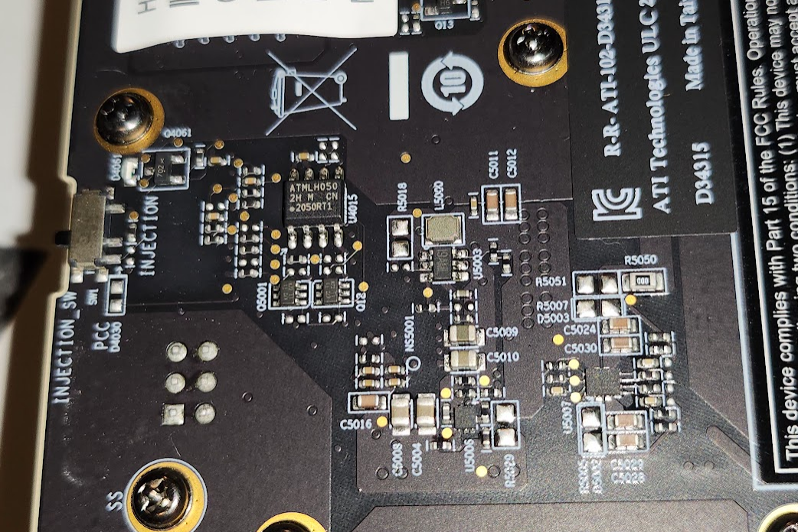
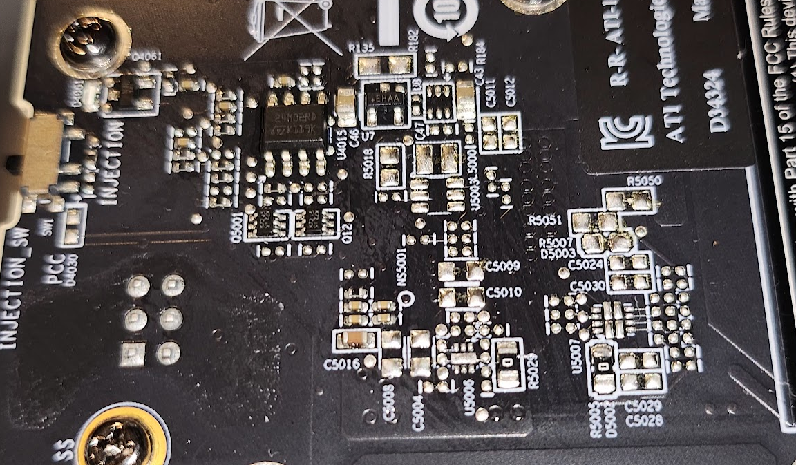

+++
title = "AMD Instinct MI100 Revisions"
date = 2024-11-01
description = "Multiple revisions of AMD Instinct MI100 GPUs sold in 2020 and 2021."

[taxonomies]
tags = ["amdgpu", "linux", "machine learning"]
+++

The AMD Instinct MI100 "Arcturus" GPU has had multiple revisions with different part numbers. Very little information is available online about them.

### MI100 D34315 Rev 01, certified 2020:

```
P/N: D34315
VBIOS P/N: 113-D3431500-101, 113-D3431500-100
rocm-smi "Device Rev": 0x01
# amdvbflash -biosfileinfo gpu1.rom
AMDVBFLASH version 4.79 EXTERNAL, Copyright (c) 2020 Advanced Micro Devices, Inc.

    Product Name is :    MI100 D34315 A2 XL 300W 32GB 1200m 
    Device ID is    :    738C
    Bios Version    :    000.000.000.000.016113
    Bios P/N is     :    113-D3431500-101
    Bios SSID       :    0C34
    Bios SVID       :    1002
    Bios Date is    :    11/24/20 22:21
```

[RRA Certification](https://www.rra.go.kr/ko/license/A_b_popup.do?app_no=202017210000229765) - 2020-08-20

### MI100 D34324, Also Rev 01 ??, certified 2021

```
P/N: D34324
VBIOS P/N: 113-D3432400-100
rocm-smi "Device Rev": 0x01
# amdvbflash -biosfileinfo gpu0.rom
AMDVBFLASH version 4.79 EXTERNAL, Copyright (c) 2020 Advanced Micro Devices, Inc.

    Product Name is :    MI100 D34324 A2 XL 300W 32GB 1200m 
    Device ID is    :    738C
    Bios Version    :    000.000.000.000.017958
    Bios P/N is     :    113-D3432400-100
    Bios SSID       :    0C34
    Bios SVID       :    1002
    Bios Date is    :    12/07/21 23:20 
```

[RRA certification](https://www.rra.go.kr/ko/license/A_b_popup.do?app_no=202117210000694635) - 2021-12-20

## Hardware Differences

My D34324 MI100s have some visible differences to their board layout near `INJECTION_SW`. A TPS2121 power mux has been removed and nearby some 0 ohm linking resistors have been added. I don't know what this power mux is for.  
As there were visible hardware changes, I have not tried cross flashing. It might work, but I'm not tempted enough to find out and it risks bricking them.

<figure>



<figcaption>
2020 (D34315) board's INJECTION_SW area.
</figcaption>
</figure>

<figure>



<figcaption>
2021 (D34324) board's INJECTION_SW area. Some signs of SMD rework (flux residue) and 0ohm links instead of a power mux.
</figcaption>
</figure>


## System Management Command Output

Output from various system management commands on my test system.

```
# amdvbflash -i
adapter seg  bn dn dID       asic           flash      romsize test    bios p/n    
======= ==== == == ==== =============== ============== ======= ==== ================
   0    0000 05 00 738C MI100(Slave)    GD25Q80C        100000 pass 113-D3432400-100
   1    0000 45 00 738C MI100(Slave)    GD25Q80C        100000 pass 113-D3431500-101
```

rocm-smi info:

```
$ nix run .#rocmPackages.rocm-smi -- --showhw --alldevices -i -v
GPU  NODE  DID     GUID   GFX VER  GFX RAS  SDMA RAS  UMC RAS  VBIOS             BUS           PARTITION ID  
0    8     0x738c  45705  gfx9008  ENABLED  ENABLED   ENABLED  113-D3432400-100  0000:05:00.0  0             
1    9     0x738c  17080  gfx9008  ENABLED  ENABLED   ENABLED  113-D3431500-101  0000:45:00.0  0             
GPU[0]          : Device Name:          0x1002
GPU[0]          : Device ID:            0x738c
GPU[0]          : Device Rev:           0x01
GPU[0]          : Subsystem ID:         0x1002
GPU[0]          : GUID:                 45705
GPU[1]          : Device Name:          0x1002
GPU[1]          : Device ID:            0x738c
GPU[1]          : Device Rev:           0x01
GPU[1]          : Subsystem ID:         0x1002
GPU[1]          : GUID:                 17080
GPU[0]          : VBIOS version: 113-D3432400-100
GPU[1]          : VBIOS version: 113-D3431500-101
```
