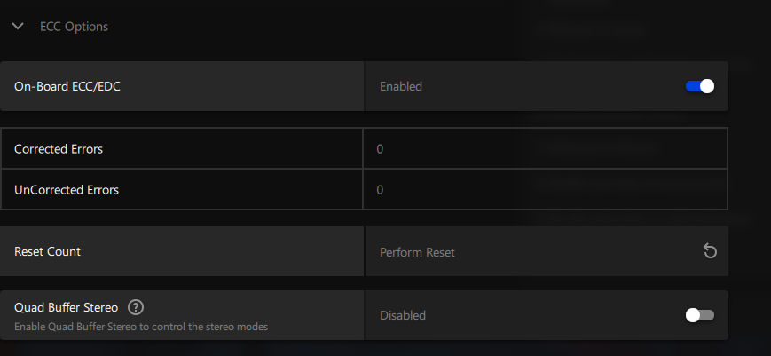

+++
title = "Disabling ECC on a Radeon Pro GPU on Linux"
date = 2022-09-28
description = "Get 7% more VRAM for your machine learning misadventures!"
draft = false

[taxonomies]
tags = ["amdgpu", "linux", "ecc"]
+++

ECC is optional on AMD's Pro GPUs, if you turn it off you get slightly more VRAM. On windows, this is as easy as flipping a switch in the Radeon control panel.



On Linux, this is possible but not documented.

### Turning it off

Boot once with a patched kernel which returns false from `amdgpu_atomfirmware_mem_ecc_supported`

<details>

<summary>amdgpu-no-ecc.patch</summary>


```
diff --git a/drivers/gpu/drm/amd/amdgpu/amdgpu_atomfirmware.c b/drivers/gpu/drm/amd/amdgpu/amdgpu_atomfirmware.c
index a06e72f474f..61314fcb161 100644
--- a/drivers/gpu/drm/amd/amdgpu/amdgpu_atomfirmware.c
+++ b/drivers/gpu/drm/amd/amdgpu/amdgpu_atomfirmware.c
@@ -615,14 +615,15 @@
 /*
  * Return true if vbios enabled ecc by default, if umc info table is available
  * or false if ecc is not enabled or umc info table is not available
  */
 bool amdgpu_atomfirmware_mem_ecc_supported(struct amdgpu_device *adev)
 {
+	return false;
 	struct amdgpu_mode_info *mode_info = &adev->mode_info;
 	int index;
 	u16 data_offset, size;
 	union umc_info *umc_info;
 	u8 frev, crev;
 	bool ecc_default_enabled = false;
 	u8 umc_config;
 	u32 umc_config1;
```

</details>

You should see "GECC will be disabled in next boot cycle if set amdgpu_ras_enable and/or amdgpu_ras_mask to 0x0" in dmesg.  
Do what it says, and boot again with `amdgpu.ras_enable=0` added as a kernel parameter.

Your GPU should now boot with ECC disabled and more VRAM available!

```
$ dmesg | grep -i ecc
amdgpu 0000:06:00.0: amdgpu: MEM ECC is not presented.
amdgpu 0000:06:00.0: amdgpu: SRAM ECC is not presented.
amdgpu 0000:06:00.0: amdgpu: GECC is disabled
```

### Turning it back off

Revert the patch, remove the param, and reboot.  
You may have to reboot twice.
