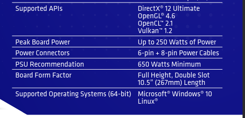

+++
title = "AMDGPU 5.15/6.x Power Limit Issues and a Bodge"
date = "2024-09-14"
[taxonomies]
tags = ["amdgpu", "linux", "machine learning"]
+++
`amdgpu` started enforcing power limits more strictly around the release of 5.15 and 6.x kernels but the implementation is broken or has unintended consequences[^1], limiting some GPUs to exactly their initial TDP limit.  
It's possible the code is now working 'correctly' but the VBIOS table TDP limits were not previously enforced and so are incorrect in many older cards.

A Radeon Pro W6800 is supposed to have a 250W peak board power limit per the datasheet:

<figure>



<figcaption>
AMDGPU power limit spec for W6800 Pro, captured from [radeon-pro-w6800-datasheet.pdf](https://www.amd.com/content/dam/amd/en/documents/products/graphics/workstation/radeon-pro-w6800-datasheet.pdf)
</figcaption>

</figure>

On 5.x kernels it was possible to set the hwmon power limit to 230W.  
On a 6.x kernel it's stuck at 213W and can't be increased or _decreased_ even with ppfeaturemask set to 0xffffffff.

This patch increases the power limit ranges for min and max in AMDGPU's smu and powerplay code. It's blind to whether the specific card needs the workaround, it doesn't know what the max/min should be.

## amdgpu-plimit-override.patch

**Use at your own risk.**

```patch
WARNING: This patch willfully ignores power limit tables and may cause your GPU to fail or damage the system it is connected to.
By applying this patch you agree that you will not hold the author liable for any damage to your system.
Use at your own risk.
--- a/drivers/gpu/drm/amd/pm/powerplay/amd_powerplay.c
+++ b/drivers/gpu/drm/amd/pm/powerplay/amd_powerplay.c
@@ -983,6 +983,7 @@ static int amdgpu_set_power_limit(void *handle, uint32_t limit)
 		limit = hwmgr->default_power_limit;
 
 	max_power_limit = hwmgr->default_power_limit;
+	max_power_limit = (max_power_limit * 3) / 2;
 	if (hwmgr->od_enabled) {
 		max_power_limit *= (100 + hwmgr->platform_descriptor.TDPODLimit);
 		max_power_limit /= 100;

--- a/drivers/gpu/drm/amd/pm/swsmu/amdgpu_smu.c
+++ b/drivers/gpu/drm/amd/pm/swsmu/amdgpu_smu.c
@@ -849,5 +849,7 @@ int smu_init(struct amdgpu_device *adev)
 		return ret;
 	}

+	smu->max_power_limit = (smu->max_power_limit * 3) / 2;
+	smu->min_power_limit = (smu->min_power_limit * 2) / 3;
 	if (!amdgpu_sriov_vf(adev))
 		smu_get_unique_id(smu);
```
## Testing

Works on my machine with Radeon Pro W6800s, allows setting hwmon/power1_cap to 275W and actual usage is able to exceed 213W again.

```bash
$ echo 275000000 | sudo tee /sys/class/drm/card0/device/hwmon/hwmon4/power1_cap
$ nix shell pkgs#rocmPackages.rocm-smi -c rocm-smi
================================================ Concise Info ================================================
Device  [Model : Revision]    Temp    Power  Partitions      SCLK  MCLK   Fan    Perf    PwrCap  VRAM%  GPU%  
        Name (20 chars)       (Edge)  (Avg)  (Mem, Compute)                                                   
==============================================================================================================
0       [0x1002 : 0x00]       25.0°C  9.0W   N/A, N/A        0Mhz  96Mhz  20.0%  manual  275.0W    0%   0%    
        0x1002                                                                                                
1       [0x1002 : 0x00]       27.0°C  7.0W   N/A, N/A        0Mhz  96Mhz  20.0%  manual  275.0W    0%   0%    
        0x1002                                                                                                
```

[^1]: Related issues: [drm/amd#3183: RX 6700XT power limit](https://gitlab.freedesktop.org/drm/amd/-/issues/3183), [drm/amd#3625: RX 7000 sysfs issues](https://gitlab.freedesktop.org/drm/amd/-/issues/3625), [drm/amd#1812: RX 6800M power limit](https://gitlab.freedesktop.org/drm/amd/-/issues/1812)
