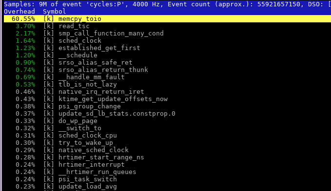
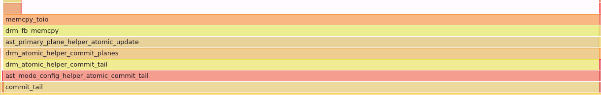

+++
title = "AST2500 GPU driver is very slow due to MMIO framebuffer copies"
description = "Notes on AST2500 DRM GPU driver performance issues"
date = 2024-11-09

[taxonomies]
tags = ["linux", "performance"]
+++

The `ast` Linux DRM GPU driver is *extremely* slow at page flipping.

A simple test app which performs atomic commits on a 1080p display takes ~45ms per page flip.

The issue seems to be horrendously slow copying of framebuffers to VRAM.

AST2500 cards appear to support DMA however the ast driver doesn't use it.

It may be possible to adapt [XDMA code in github:eddiejames/xdma-test](
https://github.com/eddiejames/xdma-test/blob/master/host/ast-bmc-pcie.c) for the `ast` GPU driver.  
I'll update this article if I get that working or fail to.