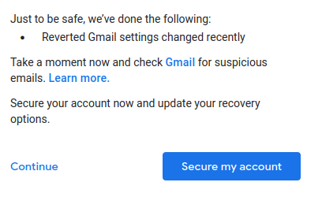
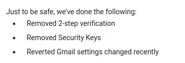

+++
title = "Google removed my Yubikeys from a google account 'Just to be safe'"
date = 2022-12-26
description = "The world's worst security flow"

[taxonomies]
tags = ["google", "security"]
+++

It's boxing day and I'm at home trying to look at some old youtube videos on an old google account. I accidentally stumble into the world's worst security flow instead.

Opening youtube's creator studio caused the account to be logged out and I got stuck on an error page.
That's a bit odd, but I guess I can log back in.

I logged back in, used my security key, and was then forced to reset my password and greeted with this message:

I visited my gmail settings and discovered a forwarding rule I'd had setup for a few years had been removed.  
I don't think that's what recently means, google.

I visited the youtube creator studio and then got logged out again, and forced to reset my password again.

This time it got worse.

Removing physical U2F keys from an account without request seems to be the worst possible reaction to suspicious activity.

I won't be visiting youtube creator studio for a third time. I anticipate the result will be something like this.

> Just to be safe, we've done the following:
>
> * Dispatched a kill team to your home address

As google has no support channels I can use, my only recourse is to write this blog post and hope someone sees it.  
If you're at google and able to look into this you can contact me at smooth.boat3358 AT fastmail.com.