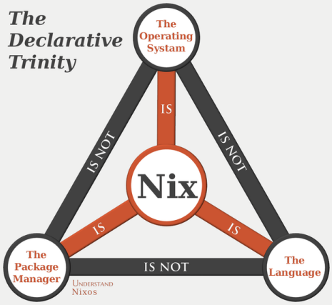

+++
title = "Nix on the brain"
date = 2022-07-15
description = "Nix on the brain, or how all your mental models from other distros will clash"
draft = true

[taxonomies]
tags = ["linux", "nixos", "nix"]
+++

I love Nix and NixOS. Getting started with it is hard, the concepts you're used to don't quite fit right and all your mental models are wrong.  
This is my attempt at an introduction that dives right into pain points and the differences involved in using Nix. It's not intended as a tutorial.

# "Nix"

What is "Nix"?

<figure>  


<figcaption>Image from <a href=https://github.com/gytis-ivaskevicius/high-quality-nix-content/tree/master/memes>gytis-ivaskevicius/high-quality-nix-content</a>.</figcaption>
</figure>

.. `nix run pkgs#optipng`

The Nix expression language goes in .nix files. It's functional, dynamically typed, and has janky syntax.  
The Nix package manager and Nix command evalute .nix files, and build packages/derivations from them or download them from caches.  
NixOS is a Linux distribution which is built using Nix.

The NixOS module system bolts types and the ability to merge multiple expressions onto Nix, and in return you get incomprehensible stack traces when something goes wrong evaluating it. Maybe one day Nix will get types.

## Build a package

I want to build a package. Let's go with firefox. This is a huge package and will take a long time to build, probably.

```
$ nix build --print-out-paths --no-link nixpkgs#firefox
/nix/store/zpp192h1ggsi6c7m6gv59vhjbx6bciy8-firefox-102.0.1
$ # 0s elapsed
```

That definitely wasn't enough time to build or download it. This package is already in my nix store.

```
$ nix build --print-out-paths --no-link nixpkgs#gimp
/nix/store/v861a1mk33pwsc2vld75xn5klg6mkh7x-gimp-2.10.32
$ # a progress bar was briefly shown and a few seconds elapsed
```

I didn't already have gimp in the store, so it downloaded it from cache.nixos.org.

## Install a package

```
$ nix run nixpkgs#firefox
# firefox launched
```

Do I need to 'install' firefox? What does 'install' mean? Having the binary on the path? Having it on your system somewhere?

I googled how to install a package with Nix, and the top suggestion was `nix-env -iA nixpkgs.firefox`. This will work, but it's stateful.  
This will add the package to the profile for your current user. On NixOS that'll be stored at `/nix/var/nix/profiles/per-user/$USER`.  
This doesn't get you many advantages over using something like `apt-get` to manage dependencies. We can do better?