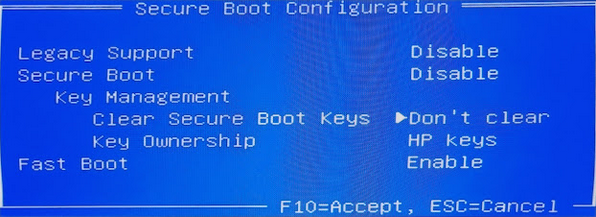

+++
title = "WIP: NixOS Router Setup"
date = 2023-11-23
description = "WIP: Setting up a NixOS router on a HP T740 thin client from scratch"

[taxonomies]
tags = ["nixos"]
+++
# WIP Article

This article may be updated in the future if I find the time, I'm publishing it now so it doesn't sit as a draft forever and so I can use it as a reference in the future.

# Hardware

<figure>


<figcaption>
An HP T7490 thin client with a 4 core Ryzen V1756B and a PCIe expansion slot which can take a 4 port 10GBe NIC.
</figcaption>

</figure>

# NixOS Installer

Copy the minimal installer to a flash drive.

```
$ wget https://channels.nixos.org/nixos-22.05/latest-nixos-minimal-x86_64-linux.iso
2022-10-30 15:49:53 (10.9 MB/s) - ‘latest-nixos-minimal-x86_64-linux.iso’ saved [867172352/867172352]
$ sudo cp latest-nixos-minimal-x86_64-linux.iso /dev/sde && sudo sync
```

Disable secure boot on the T740 as NixOS doesn't have proper support for it.

<figure>



<figcaption>
UEFI Secure Boot Configuration with Secure Boot set to Disable
</figcaption>

</figure>

Run `ip addr` to find the "predictable interface names" that got picked for your NICs. Note these down for later in your config.

```
$ ip addr
1: lo
2: enp2s0f0
3: enp1s0f0
4: enp1s0f1
5: enp1s0f2
6: enp1s0f3
```

# Writing the configuration

## Router Config Checklist

- [x] DNS - `services.dnsmasq.*`
- [x] DHCP - `services.dnsmasq.settings.dhcp-*`
- [x] NAT - `networking.nat.*`
- [x] UPNP/NAT-PMP - `services.miniupnpd`
- [x] Firewall - `networking.firewall.*`
- [ ] IPv6 RA - ISP doesn't have v6 so have not properly tested v6 setup
- [ ] IPv6 ULA

Time to write the config. Here's what I ended up with: [github:LunNova/nixos-configs/dev/hosts/router/default.nix](https://github.com/LunNova/nixos-configs/blob/91b3c3db0b717eb0215724c0aa6fff7002ab4437/hosts/router/default.nix).

## Testing the config builds

Run `nix build .#nixosConfigurations.router-nixos.config.system.build.toplevel` (substitute router-nixos for the hostname you used) to build the system derivation for the router.

This lets us verify the build on another machine instead of having to test things on the partially set up router.

## Installing

### Partitioning

Let's clone my standard partitioning script for a tmpfs root system.

```
$ wget https://github.com/LunNova/nixos-configs/raw/dev/scripts/install/partition.sh
```

Next we need to edit it to match the correct local drive which we can find with `lsblk -f`. On this system that's `nvme0n1`.
Run it and confirm the partition layout looks good.

### Installing NixOS

```
$ wget https://github.com/LunNova/nixos-configs/raw/dev/scripts/install/install.sh
```

Edit `install.sh` and update `HOSTNAME` and `PERSIST_PARTITION` to match the configuration.

Run the script and wait for the install to finish.


