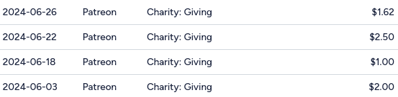

+++
title = "Patreon should allow opt-in billing alignment"
date = 2024-09-10
description = "Patreon is removing all ways to align billing on one day, complicating budgeting, increasing transaction fees and frustrating creators"

[extra]
icon = "/articles/patreon-should-allow-opt-in-billing-alignment/ai-gen-patreon-strategy-room.jpg"

[taxonomies]
tags = ["patreon", "finance"]
+++

Patreon is a platform that allows creators to receive financial support from their fans through recurring payments.

<figure>  

<figcaption>machine dream of Patreon's strategy room. maybe their decisions are also dreampt up by machine?</figcaption>
</figure>

Patreon announced[^1] they're removing all options to align billing dates for multiple pledges into a single monthly credit card charge (previously opt-in on the creators' side); this change - kicking in November 2024 - affects both pledgers and creators on all platforms.[^2]

My Patreon charges are already a mess with multiple tiny charges every month

I understand Patreon might have reasons for this decision; but it seems counterintuitive from a user perspective. Allowing users to opt-in to aligned billing would simplify expense tracking for supporters and lower per-transaction fees.

Patreon isn't publicly traded so we can't look at quarterly reports to verify if this is increasing overhead significantly, but it's hard to see how it could be doing anything but.

Patreon justifies this change with Apple's app store rules:

> To keep the Patreon app available in the Apple App Store for all creators, Apple is requiring that we use their in-app purchase system for new memberships in the Patreon iOS app beginning in November 2024. Apple's in-app purchase system only supports our subscription billing model.[^1]

This fails to address why the change needs to affect users subscribing outside of the iOS app. The announcement further states:

> Over the past year, we tested a variety of billing models, including some that combined members' bills to multiple creators. This current subscription billing model ensures creators are paid in full and upfront when a member signs up (which is important for content protection and benefit delivery), and provides a simple, familiar billing experience for members.[^1]

On the surface this gives insight into their decision-making process; yet it doesn't explain why an opt-in aligned billing option can't be maintained for users who prefer it, even if it took a full billing cycle to kick in for the "content protection and benefit delivery" part.

On the creator side, monthly billing is crucial for goods which need to be produced in batches and shipped. Having to plan ahead for extras or to produce one-offs is bad for both creators and pledgers. How is forcing creators to handle people signing up at the end of the month good for "benefit delivery"?!

I'm baffled by Patreon's decisions and suspect they're not being transparent about the actual reasons. Maybe lots of smaller transactions make people less likely to notice a big charge and decide to unsub?

I hope Patreon reconsiders.

[^1]: [Patreon Subscription Billing FAQ. 2024-08-09T09:47Z](https://support.patreon.com/hc/en-us/articles/8779192853261-Subscription-Billing-FAQ) ([archived](https://archive.is/JaAHR))

[^2]: [Reddit user /u/PropagandaSucks expressed frustration: "They are removing 1st of the month billing because of bloody Apple. GG creators who rely on 1st of month for their budget and bills."](https://old.reddit.com/r/patreon/comments/1eqeanh/they_are_removing_1st_of_the_month_billing/) ([archived](https://archive.is/FBKkH))
