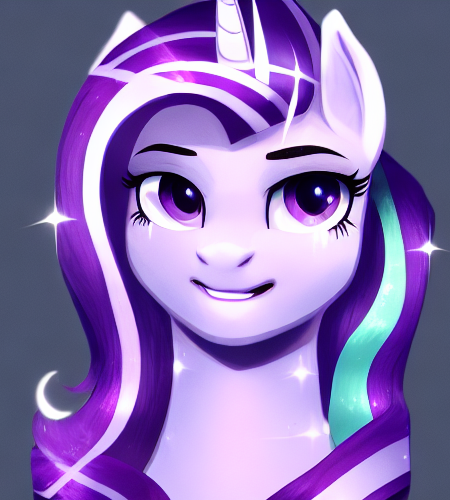
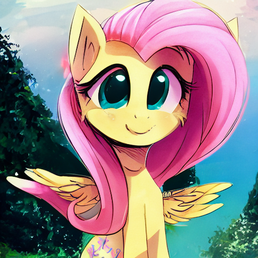

+++
title = "Lun's Pony Diffusion Models"
date = 2022-10-11
description = "Stable Diffusion finetuned on derpibooru"

[taxonomies]
tags = ["machine learning", "image generation", "stable diffusion", "my little pony"]
+++

<!-- toc -->

# V2

This model was finetuned from Stable Diffusion's 1.4 release with batch size 3 and `5e-6` learning rate on a single Radeon Pro W6800 GPU.

The autoencoder was finetuned for ~120,000 steps before finetuning the rest of the model.

## Full finetune release

Pending release in a day or so.

## Short finetune / Beta (2022-10-11) Model

This checkpoint was captured after ~26,000 steps (~80,000 images) of training, which took 12 hours. This isn't even a full epoch.

Captions use space separated tags. Spaces within tags should be replaced with underscores.

<figure>

<figcaption>pony s5_starlight unicorn glimmer this_will_end_in_communism scr100 bust mare portrait by=pierogarts female safe looking_at_you solo</figcaption>
</figure>

This shows that finetuning to a reasonable quality level does not need a huge cluster of expensive datacenter GPUs.

* [`sd1.4 finetuned v2 derpibooru e=0000 gs=026400.ckpt`](https://mega.nz/file/dFYmUQDS#8AZCBCA8btOrPZCVhJ1hWnL1NGzJCzQV3hvTGPOCKpw)

# V1 (2022-10-01) Model

This model was finetuned for ~500,000 steps at multiple different batch sizes and learning rates. It performs better than the current V2 model due to its longer training time, but I expect it to be surpassed soon.

The training captions used comma separated tags.

<figure>

<figcaption>fluttershy, blush, pony, pomf, cute, adorable, daww, solo, scenery, scr800, flying, pegasus</figcaption>
</figure>

* [`sd1.4 finetuned derpibooru safe suggestive e=0002 gs=287000.ckpt`](https://mega.nz/file/MMoHwRCa#p06t5SVCSSlEvwVmDOf9B8StDw7BJ0gidS7Y62HjDtM)
* [`sd1.4 finetuned derpibooru safe suggestive e=0007 gs=460000.ckpt`](https://mega.nz/file/UJx0TDZS#i6Y12ajvndy0YKbM6pvOTQuQYI5zpKeDTl73l9S8XsI)

# Training Code

These models were trained using [github:LunNova/translunar-diffusion](https://github.com/LunNova/translunar-diffusion).

Please see [the stable diffusion training notes](@/articles/stable-diffusion-training-notes/index.md#amdgpu-hang) for more details.

# Model Licenses

These releases are all licensed under the [CreativeML Open RAIL-M License](https://github.com/CompVis/stable-diffusion/blob/main/LICENSE), as required for derivatives of the original stable diffusion model.