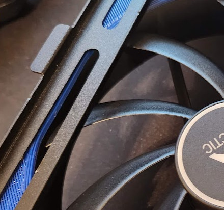
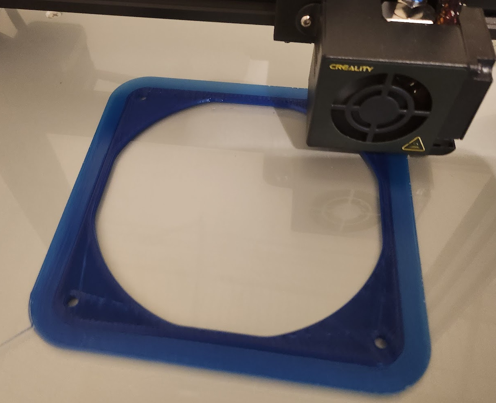
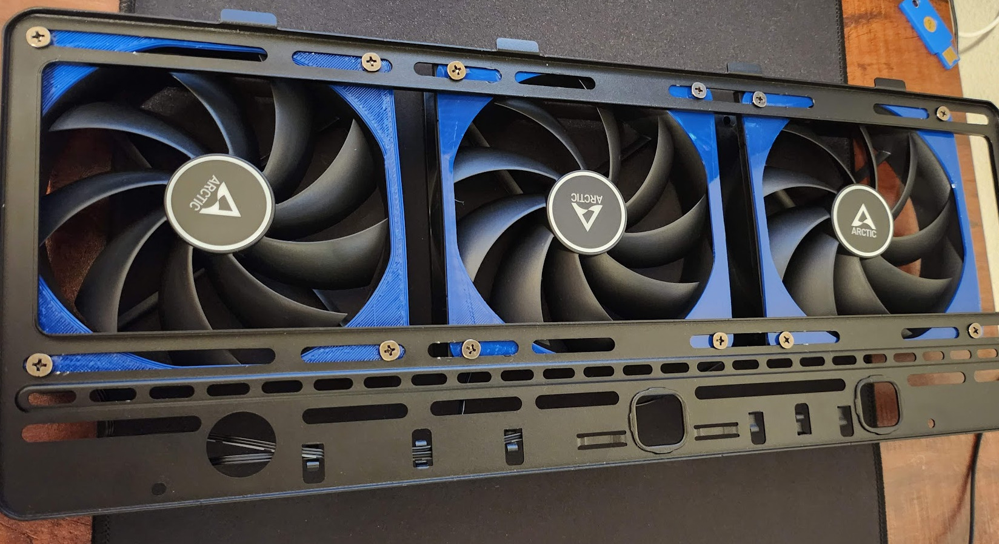

+++
title = "Quieting ROG Strix Helios top mounted case fans"
date = 2022-10-13
description = "3D printing gaskets to reduce noise when mounting case fans"

[taxonomies]
tags = ["pc building", "3d printing"]
+++

The ROG Strix Helios case accepts 3 x 120mm fans in the top of the case. The mount is also a radiator mount, so it's flat unlike most case fan mounts which raise the mounting holes to get some clearance between the fan blades and the anti-finger-slicey grille.

I used these as intakes and found an annoying whining noise which was caused by the fans spinning too close to metal next to the blades, due to poor design of the mount.

<figure>

<figcaption>Without a spacer installed, this flat metal section is very close to the fan blades</figcaption>
</figure>

It's easy to fix by buying or printing some fan spacers.

I used [Fan Gasket 120mm for TPU by br34ker](https://www.thingiverse.com/thing:2628592). Printing in TPU is a good idea as it's soft and will act to dampen vibrations, but other filaments might work okay if you don't have any.

<figure>

<figcaption>Printing the spacer on a Creality CR-10</figcaption>
</figure>

I printed three of these over a couple of hours. Only one failed print due to a jam which is pretty decent for flexible filament on a bowden extruder.

Once printed, I mounted them between the fans and the top radiator mounting bracket.

<figure>

<figcaption>It works! The fans all fit, and when I hooked them up again there was no annoying whining sound :)</figcaption>
</figure>