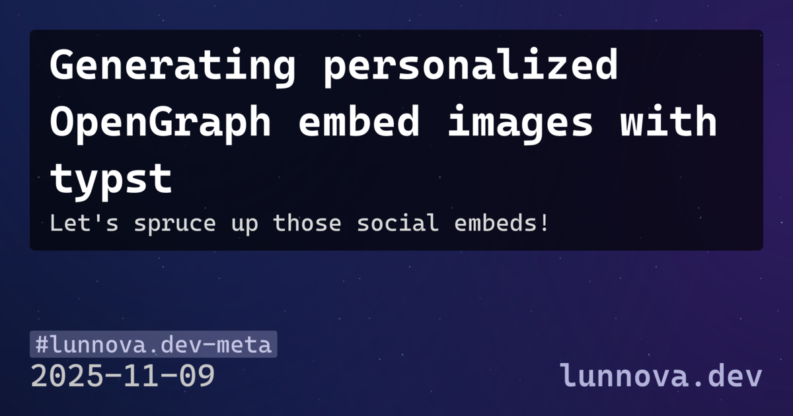

+++
title = "Generating personalized OpenGraph embed images with typst"
date = 2025-11-09
description = "Let's spruce up those social embeds!"
embed_image = "/articles/typst-opengraph-embed/og-image.png"
tags = ["lunnova.dev-meta"]
+++

<figure>



<figcaption>

This article's generated OpenGraph image

</figcaption>
</figure>

OpenGraph[^og_spec] meta tags allow customizing how a site's link previews display when embedded elsewhere. Originally popularized by facebook, OpenGraph data is now used by most social media, chat apps, and read-it-later services like Instapaper.

I was inspired by crates.io[^crates_inspiration]'s new OpenGraph embed images to use a typst[^typst] template for this.  
We don't need a production grade crate like crates.io; a quick shell script will suffice.

A bash script extracts TOML frontmatter[^toml_parse] from articles and then passes it to a typst template, and outputs a 1200×630[^og_size] image.

```typ
#let data = json(bytes(sys.inputs.data))
#set page(width: 1200pt, height: 630pt, margin: 0pt)
#set text(font: "CaskaydiaCove NF", fill: white)

// Cropped background - each article gets unique viewport into 1515×2154 bg
#place(left + top, block(width: 1200pt, height: 630pt, clip: true, {
  place(left + top, dx: -data.crop_x * 1pt, dy: -data.crop_y * 1pt,
    image("bg-full.png", width: 1515pt, height: 2154pt))
}))

// Title and description
#place(left + top, dx: 45pt, dy: 45pt, rect(
  fill: rgb(0,0,0,65%), radius: 8pt, inset: 30pt, {
    text(size: 64pt, weight: "bold", data.title)
    v(20pt)
    if data.at("description", default: none) != none {
      text(size: 36pt, fill: rgb(220,220,220), data.description)
    }
  }
))

// Tags, date, branding
#place(bottom + left, dx: 45pt, dy: -45pt, stack(dir: ttb, spacing: 10pt, {
  for (i, tag) in data.tags.enumerate() {
    if i > 0 { h(8pt) }
    box(fill: rgb(180,180,220,30%), radius: 4pt, inset: (x: 8pt, y: 8pt),
      text(size: 36pt, fill: rgb(200,200,230), "#" + tag))
  }
}, {
  stack(dir: ltr,
    text(size: 48pt, data.date), h(1fr),
    text(size: 48pt, weight: "semibold", "lunnova.dev"))
}))
```

Full template: [og-template/template.typ](https://github.com/LunNova/Blog/blob/main/og-template/template.typ)

The template I settled on renders title, description, tags and date over a cropped starfield background. Crop coordinates are deterministic[^hash_crop] based on the article path's hash, giving each post a unique view of the same background if I regenerate without storing per-article state. Honestly that's overengineering and it really doesn't matter if those move on regen but eh, it's fun.


```bash
DATA_JSON=$(jq -n \
    --arg title "$TITLE" \
    --arg description "$DESCRIPTION" \
    --arg date "$DATE" \
    --argjson tags "$TAGS" \
    --argjson crop_x "$CROP_X" \
    --argjson crop_y "$CROP_Y" \
    '{title: $title, description: $description, date: $date, tags: $tags, crop_x: $crop_x, crop_y: $crop_y}')

echo "Generating: '$TITLE' → $OUTPUT_PATH"
set -x

pushd "$TEMPLATE_DIR" >/dev/null
TEMP_2X=$(mktemp --suffix=.png)
trap "rm -f $TEMP_2X" EXIT

typst compile --format png --input "data=$DATA_JSON" template.typ "$TEMP_2X"
popd >/dev/null
magick "$TEMP_2X" -resize 1200x630 -quality 95 "$OUTPUT_PATH"
optipng -quiet -strip all "$OUTPUT_PATH"
```

```console
./generate-og-image.sh content/articles/typst-opengraph-embed/index.md
Generating: 'Generating personalized OpenGraph embed images with typst' → content/articles/typst-opengraph-embed/og-image.png
+ pushd /home/lun/sync/dev/lun/Blog/og-template
++ mktemp --suffix=.png
+ TEMP_2X=/tmp/nix-shell.ijbkuM/nix-shell-2799969-130597325/tmp.Wk2f9FYuzX.png
+ trap 'rm -f /tmp/nix-shell.ijbkuM/nix-shell-2799969-130597325/tmp.Wk2f9FYuzX.png' EXIT
+ typst compile --format png --input $'data={\n  "title": "Generating personalized OpenGraph embed images with typst",\n  "description": "Let\'s spruce up those social embeds!",\n  "date": "2025-11-09",\n  "tags": [\n    "lunnova.dev-meta"\n  ],\n  "crop_x": 2,\n  "crop_y": 406\n}' template.typ /tmp/nix-shell.ijbkuM/nix-shell-2799969-130597325/tmp.Wk2f9FYuzX.png
+ popd
+ magick /tmp/nix-shell.ijbkuM/nix-shell-2799969-130597325/tmp.Wk2f9FYuzX.png -resize 1200x630 -quality 95 content/articles/typst-opengraph-embed/og-image.png
+ optipng -quiet -strip all content/articles/typst-opengraph-embed/og-image.png
+ rm -f /tmp/nix-shell.ijbkuM/nix-shell-2799969-130597325/tmp.Wk2f9FYuzX.png
```

[^og_spec]: [https://ogp.me/](https://ogp.me/) defines og:image for link previews.

[^typst]: [https://typst.app/](https://typst.app/) is a markup-based typesetting system. It's easier to work with than LaTeX.

[^toml_parse]: I ended up using a tiny python script to load with tomllib and dump as json because `yj-go` didn't like my use of the TOML date type in front matter

[^og_size]: OpenGraph images are typically 1200×630px (1.91:1 ratio). Generated at 2x resolution (2400×1260) then downscaled with ImageMagick for better font rendering, optimized with optipng. Typically around 200KiB, YMMV will vary based on your template design.

[^hash_crop]: sha256sum of article path → extract hex digits → modulo by max offset. Same path always gives same crop position. Background is 1515×2154px, crops to 1200×630px, allowing 315px horizontal and 1524px vertical variance.

[^crates_inspiration]: [Add OpenGraph image generation crate](https://github.com/rust-lang/crates.io/pull/11436) by Tobias Bieniek ([@Turbo87](https://github.com/Turbo87))
